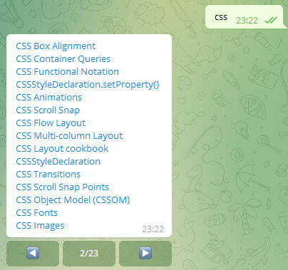
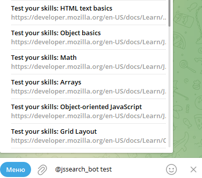

# Telegram бот для поиска информации на MDN

Бот для поиска статей на MDN Web Docs, реализованный на Node.js + Typescript. <br>
Используется пакет [Telegraf](https://telegraf.js.org) для Node.js.
Реализована пагинация результатов, инлайн режим и стандартные команды взаимодействия с ботом.

## Демо

[jssearch_bot](https://t.me/jssearch_bot)
<br>
**Поиск в сообщениях** <br>

<br>
**Инлайн-поиск** <br>


## Запуск

```console
git clone https://github.com/vadmitriev/jssearch
```

```console
cd jssearch
```

```console
cp env.sample .env
```

- Указать переменной `BOT_TOKEN` в файле `.env` значение токена.

```console
npm install
```

```console
npm run start
```
